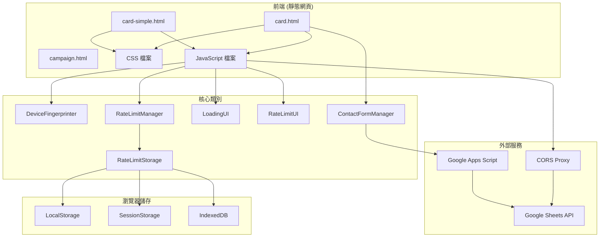
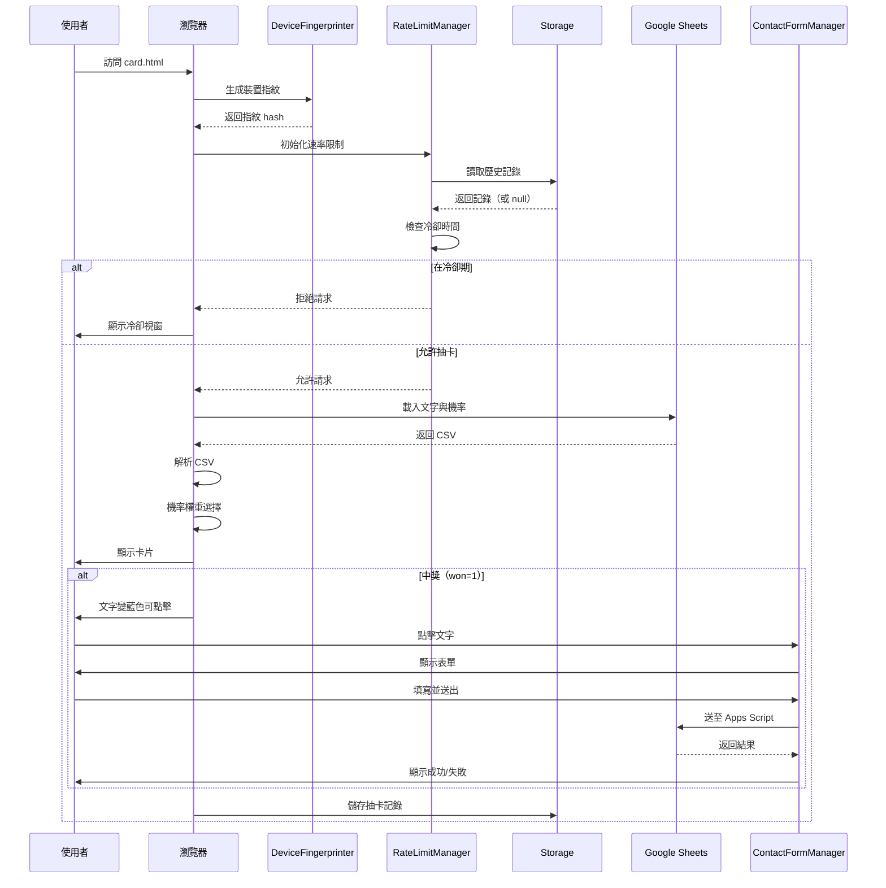

# 技術架構文檔

## 📚 文檔概覽

本文檔說明 Comoor 專案的技術架構、系統元件、資料流程與整合點。

## 🏗️ 系統架構圖



## 🎯 檔案結構

### HTML 檔案

| 檔案 | 大小 | 依賴 | 用途 |
|------|------|------|------|
| `campaign.html` | ~7KB | 無（自包含） | 活動報名表單 |
| `card.html` | ~4KB | card.css, card.js | 抽卡系統（含中獎） |
| `card-simple.html` | ~0.5KB | card-simple.css, card-simple.js | 簡易抽卡系統 |

### CSS 檔案

| 檔案 | 大小 | 說明 |
|------|------|------|
| `css/card.css` | ~18KB | card.html 完整樣式（含表單） |
| `css/card-simple.css` | ~10KB | card-simple.html 簡化樣式 |

### JavaScript 檔案

| 檔案 | 行數 | 說明 |
|------|------|------|
| `js/card.js` | 1,824 | 完整功能（含中獎系統） |
| `js/card-simple.js` | 1,147 | 簡化版本（無中獎） |

### 資源檔案

```
assets/
└── images/
    ├── background/
    │   ├── image-1.jpg
    │   ├── image-2.jpg
    │   ├── image-3.jpg
    │   ├── image-4.jpg
    │   └── image-5.jpg
    ├── cooldown-red.jpg
    └── cooldown-yellow.jpg
```

## 🧩 核心類別

### 1. DeviceFingerprinter

**職責**：生成裝置指紋

**關鍵方法**：
```javascript
class DeviceFingerprinter {
    async generateFingerprint()           // 生成完整指紋
    getScreenFingerprint()                 // 螢幕特徵
    getTimezoneFingerprint()              // 時區資訊
    getLanguageFingerprint()              // 語言偏好
    getPlatformFingerprint()              // 平台資訊
    getUserAgentFingerprint()             // User Agent
    getPluginsFingerprint()               // 瀏覽器插件
    async getFontsFingerprint()           // 字體偵測
    getCanvasFingerprint()                // Canvas 指紋
    getWebGLFingerprint()                 // WebGL 指紋
    async getAudioFingerprint()           // 音訊指紋
    async hashString(str)                 // SHA-256 雜湊
}
```

**依賴**：
- Web Crypto API
- Canvas API
- WebGL API
- Web Audio API

### 2. RateLimitStorage

**職責**：管理速率限制資料的儲存與讀取

**關鍵方法**：
```javascript
class RateLimitStorage {
    async storeRateLimit(timestamp, fingerprint)  // 儲存記錄
    async getRateLimit()                          // 讀取記錄
    validateStoredData(data)                      // 驗證資料
    async storeInIndexedDB(data)                  // IndexedDB 儲存
    async getFromIndexedDB()                      // IndexedDB 讀取
    clearAll()                                     // 清除所有記錄
}
```

**儲存策略**：
- **主要**：LocalStorage
- **備份 1**：SessionStorage
- **備份 2**：IndexedDB

### 3. RateLimitManager

**職責**：執行速率限制邏輯

**關鍵方法**：
```javascript
class RateLimitManager {
    async initialize()                              // 初始化系統
    async checkRateLimit(existingData)             // 檢查限制
    async compareFingerprintsWithFuzzyMatching()   // 模糊比對
    calculateStringSimilarity(str1, str2)          // 字串相似度
    levenshteinDistance(str1, str2)                // 編輯距離
    async recordCardRequest()                      // 記錄請求
    getRemainingCooldownTime()                     // 剩餘時間
    formatRemainingTime(ms)                        // 格式化時間
    clearAllData()                                  // 清除資料
}
```

**決策邏輯**：
```
1. 無記錄 → 允許
2. 有記錄 + 過期 + 指紋匹配 → 允許
3. 有記錄 + 未過期 + 指紋匹配 → 拒絕
4. 有記錄 + 指紋不匹配 → 允許（不同裝置）
```

### 4. LoadingUI

**職責**：管理載入動畫

**關鍵方法**：
```javascript
class LoadingUI {
    showLoadingOverlay()                 // 顯示載入
    hideLoadingOverlay()                 // 隱藏載入
    async showLoadingFor(durationMs)    // 顯示指定時間
}
```

### 5. RateLimitUI

**職責**：顯示速率限制介面

**關鍵方法**：
```javascript
class RateLimitUI {
    showRateLimitOverlay(rateLimitResult)  // 顯示冷卻視窗
    generateOverlayHTML(rateLimitResult)    // 生成 HTML
    startCountdown(remainingTimeMs)         // 開始倒數
    hideRateLimitOverlay()                  // 隱藏視窗
    refreshPage()                            // 重新整理
    showSuccessMessage()                     // 成功訊息
    destroy()                                 // 清理資源
}
```

### 6. ContactFormManager（僅 card.js）

**職責**：管理中獎聯絡表單

**關鍵方法**：
```javascript
class ContactFormManager {
    initialize()                              // 初始化
    showForm()                                // 顯示表單
    hideForm()                                // 隱藏表單
    resetForm()                               // 重置表單
    async handleSubmit(e)                    // 處理提交
    validateForm()                            // 驗證表單
    showFieldError(fieldName, message)       // 顯示錯誤
    clearErrors()                             // 清除錯誤
    getFormData()                             // 取得資料
    setSubmissionState(isSubmitting)         // 設定狀態
    showSuccess()                             // 成功訊息
    showError(message)                        // 錯誤訊息
    hideMessages()                            // 隱藏訊息
    async submitToGoogleSheets(formData)     // 提交試算表
    async submitViaWebApp(formData, url)     // 透過 Web App
}
```

## 🔄 資料流程

### 抽卡流程（card.html）



### 機率選擇演算法

```javascript
// 假設文字陣列：
// [
//   {text: "A", probability: 0.5},
//   {text: "B", probability: 0.3},
//   {text: "C", probability: 0.2}
// ]

function getWeightedRandomText(texts) {
    // 1. 計算總權重: 0.5 + 0.3 + 0.2 = 1.0
    const totalWeight = texts.reduce((sum, t) => sum + t.probability, 0);

    // 2. 產生 0~1 的隨機數，例如 0.65
    let random = Math.random() * totalWeight;

    // 3. 逐一扣除權重
    for (let textObj of texts) {
        random -= textObj.probability;
        // 第一輪：0.65 - 0.5 = 0.15（繼續）
        // 第二輪：0.15 - 0.3 = -0.15（< 0，選中 B）
        if (random <= 0) {
            return textObj;
        }
    }

    // 4. 降級返回最後一個
    return texts[texts.length - 1];
}
```

## 🌐 外部整合

### Google Sheets API

**用途**：載入卡片文字與機率

**URL 格式**：
```
https://docs.google.com/spreadsheets/d/{SHEET_ID}/export?format=csv&gid={GID}
```

**實際範例**：
```
https://docs.google.com/spreadsheets/d/1ecyT2EcO6shL61eaANXyIS4izuQPlL4eWwJt07GwHPE/export?format=csv&gid=0
```

**CORS 代理**：
```
https://api.allorigins.win/raw?url=[ENCODED_URL]
```

**快取策略**：
- 快取鍵：`card_texts_probabilities_cache`
- 有效期：10 分鐘
- 儲存位置：LocalStorage

### Google Apps Script Web App

**用途**：接收中獎者表單資料

**URL**：
```
https://script.google.com/macros/s/AKfycbxJ04YQhMx3KzzUAohIOMdcSOd5c1e280FAXLcYSd9J5JzZ-DWDr5_9eBZivRdpFN3xaw/exec
```

**請求格式**：
```javascript
// FormData (避免 CORS preflight)
const formData = new FormData();
formData.append('data', JSON.stringify({
    account: "...",
    phone: "...",
    recipientName: "...",
    address: "...",
    message: "...",
    timestamp: "...",
    userAgent: "..."
}));

fetch(webAppUrl, {
    method: 'POST',
    body: formData
});
```

**回應格式**：
```json
{
    "success": true,
    "message": "資料已儲存"
}
```

## 💾 資料結構

### LocalStorage 鍵值

| 鍵名 | 類型 | 說明 |
|------|------|------|
| `card_rate_limit_v2` | JSON | 主要速率限制記錄 |
| `card_rate_limit_backup_v2` | JSON | 備份記錄 |
| `card_texts_probabilities_cache` | JSON | 文字快取 |
| `card_texts_probabilities_cache_time` | String | 快取時間戳記 |

### 速率限制記錄結構

```typescript
interface RateLimitRecord {
    timestamp: number;        // 上次抽卡時間（毫秒）
    fingerprint: string;      // 64字元 SHA-256 hash
    version: number;          // 資料版本（目前為 2）
    created: number;          // 記錄建立時間（毫秒）
}
```

### 文字資料結構

```typescript
interface TextItem {
    text: string;            // 文字內容
    probability: number;     // 權重（> 0）
    won?: number;            // 0 或 1（card-simple.js 忽略）
}
```

## 🔧 設定參數

### 速率限制設定

```javascript
const RATE_LIMIT_CONFIG = {
    cooldownHours: isDevMode ? 0.002778 : 1,     // 小時
    cooldownMs: isDevMode ? 10000 : 3600000,      // 毫秒
    gracePeriodMs: 5 * 60 * 1000,                // 5分鐘寬限
    debugMode: true                               // 除錯模式
};
```

### Google Sheets 設定

```javascript
const SHEET_ID = '1ecyT2EcO6shL61eaANXyIS4izuQPlL4eWwJt07GwHPE';
const CORS_PROXY = 'https://api.allorigins.win/raw?url=';
const GID = 0; // 「金句」工作表
```

### 降級文字

```javascript
const fallbackTexts = [
    { text: "今天很開心", probability: 0.2, won: 0 },
    { text: "昨天很美好", probability: 0.2, won: 0 },
    { text: "很期待明天", probability: 0.2, won: 0 },
    { text: "這兩天都是好天氣", probability: 0.2, won: 0 },
    { text: "會是一個好年的！", probability: 0.2, won: 0 }
];
```

## 📊 效能指標

| 指標 | card.html | card-simple.html |
|------|-----------|------------------|
| 初始載入時間 | ~3 秒 | ~3 秒 |
| 指紋生成時間 | ~200ms | ~200ms |
| 試算表載入時間 | ~500ms | ~500ms |
| 總記憶體使用 | ~15MB | ~10MB |
| DOM 元素數量 | ~50 個 | ~15 個 |

## 🔐 安全性措施

| 層面 | 措施 | 效果 |
|------|------|------|
| 防刷 | 裝置指紋 + 三層儲存 | ✅ 高 |
| CSRF | 無狀態設計 | ✅ 免疫 |
| XSS | 無直接 DOM 插入 | ✅ 低風險 |
| 資料隱私 | 指紋 SHA-256 雜湊 | ✅ 保護 |
| API 濫用 | 速率限制 | ✅ 有效 |

## 🔗 相關文件

- [使用案例總覽](README.md#使用案例-use-cases)
- [防刷機制 (UC-04)](use-cases/04-rate-limiting.md)
- [部署指南](deployment-guide.md)
- [管理員手冊](admin-guide.md)

---

**最後更新**：2025-10-05
