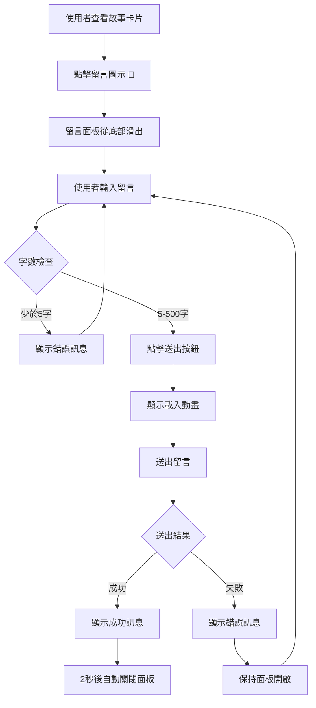

# 使用案例 08：使用者留言功能

## 📋 基本資訊

- **使用案例名稱**：使用者留言功能
- **使用案例 ID**：UC-08
- **頁面**：card.html
- **優先級**：中
- **狀態**：已實作

---

## 🎯 概述

讓使用者可以對抽到的故事卡片留言分享感想，提升互動性和情感連結。透過簡單的留言介面，使用者能夠快速表達對故事的想法，增強與內容的共鳴。

---

## 👥 參與者

- **主要參與者**：網站訪客（抽卡使用者）
- **次要參與者**：無

---

## 🎬 前置條件

- 使用者已經抽取了一張故事卡片
- 瀏覽器支援 JavaScript
- 網路連線正常

---

## ✅ 後置條件

**成功情境**：
- 留言成功儲存
- 顯示成功訊息給使用者
- 面板自動關閉

**失敗情境**：
- 顯示錯誤訊息
- 保持面板開啟允許重試

---

## 📝 主要流程

### 詳細步驟

#### 階段 1：顯示留言圖示
1. 系統在右下角顯示留言圖示（💬），位於愛心圖示上方
2. 圖示固定在畫面角落，隨視窗滾動
3. 不同裝置上圖示大小會自動調整（桌面版較大，手機版較小）

#### 階段 2：開啟留言面板
1. 使用者點擊留言圖示
2. 圖示播放點擊動畫效果
3. 螢幕出現半透明遮罩
4. 留言面板從底部滑出，覆蓋螢幕約 1/3 高度
5. 文字輸入區自動獲得焦點

#### 階段 3：輸入留言
1. 使用者在文字區域輸入留言
2. 字數計數器即時顯示已輸入字數（例如：125 / 500）
3. 當字數接近上限時，計數器顏色會改變提醒使用者：
   - 達到 450 字：變為黃色警告
   - 達到 500 字：變為紅色，無法再輸入
4. 最大輸入長度：500 字元

#### 階段 4：表單驗證
1. 使用者點擊「送出」按鈕
2. 系統檢查留言是否至少有 5 個字
3. 若未通過驗證：
   - 顯示錯誤訊息：「請輸入至少 5 個字的留言」
   - 文字框邊框變為紅色提醒
   - 使用者需要補充內容後再次送出
4. 若通過驗證，進入送出流程

#### 階段 5：送出留言
1. 按鈕顯示載入動畫（旋轉圖示 + "送出中..." 文字）
2. 送出按鈕暫時停用，防止重複送出
3. 系統將留言與故事資訊一起儲存

#### 階段 6：處理回應
**成功情境**：
1. 顯示成功訊息：「✅ 留言已成功送出！感謝您的分享！」
2. 2 秒後面板自動關閉並清空表單內容

**失敗情境**：
1. 顯示錯誤訊息：「❌ 送出失敗，請稍後再試」
2. 面板保持開啟
3. 使用者可以重新嘗試送出

---

## 🔀 替代流程

### 8a. 點擊背景關閉面板
**條件**：留言面板開啟時，使用者點擊半透明遮罩

**流程**：
1. 面板向下滑出並關閉
2. 遮罩消失
3. 輸入的內容會被清空

### 8b. 按 Escape 鍵關閉
**條件**：留言面板開啟時，使用者按下 Escape 鍵

**流程**：
1. 面板關閉
2. 輸入的內容會被清空

### 8c. 點擊關閉按鈕
**條件**：使用者點擊面板右上角的 ✕ 按鈕

**流程**：
1. 面板關閉
2. 輸入的內容會被清空

### 8d. 點擊取消按鈕
**條件**：使用者點擊「取消」按鈕

**流程**：
1. 面板關閉
2. 不儲存任何資料
3. 輸入的內容會被清空

---

## 🎨 介面說明

### 留言圖示
- **位置**：固定於視窗右下角，愛心圖示上方
- **外觀**：
  - 白色圓形背景
  - 💬 表情符號
  - 帶有陰影效果
- **互動效果**：
  - 滑鼠移到上方時：圖示變得更明顯並稍微放大
  - 點擊時：播放脈衝動畫
  - 點擊後：開啟留言面板

### 留言面板
- **遮罩**：
  - 全螢幕半透明黑色背景
  - 點擊可關閉面板

- **面板容器**：
  - 位置：固定於螢幕底部
  - 高度：約佔螢幕 1/3（不同裝置會自動調整）
  - 背景：白色
  - 上方兩個角：圓角設計
  - 陰影：向上投射的陰影效果
  - 動畫：從底部滑入螢幕

### 表單元素
- **標題**：「💬 分享您的故事感想」（粗體，20px）
- **關閉按鈕**：✕ 符號，位於右上角
- **文字輸入區**：
  - 提示文字：「分享您對這個故事的感想或想法...」
  - 邊框：預設為灰色
  - 獲得焦點時：藍色邊框
  - 驗證失敗時：紅色邊框
  - 最小高度：可輸入多行文字

- **字數計數器**：
  - 位置：文字區域右下方
  - 格式：「X / 500」
  - 顏色變化：
    - 0-449 字：灰色
    - 450-499 字：橘色（警告）
    - 500 字：紅色，粗體

- **按鈕**：
  - 取消按鈕：灰色背景
  - 送出按鈕：藍色背景，白色文字
  - 送出中狀態：顯示旋轉載入動畫

- **訊息提示**：
  - 成功訊息：綠色背景，顯示「✅ 留言已成功送出！感謝您的分享！」
  - 錯誤訊息：紅色背景，顯示錯誤原因

---

## 📱 響應式設計

### 桌面版（大螢幕）
- 留言圖示：60px 圓形
- 面板高度：螢幕的 1/3
- 文字大小：標準大小

### 平板版（中等螢幕）
- 留言圖示：56px 圓形
- 面板高度：螢幕的 40%（稍高一些）
- 文字大小：稍微縮小

### 手機版（小螢幕）
- 留言圖示：50px 圓形
- 面板高度：螢幕的 45%（更高，方便手機鍵盤彈出）
- 文字大小：適合小螢幕閱讀
- 按鈕大小：易於手指點擊

---

## 🧪 測試案例

### TC-08-01: 基本留言提交
**步驟**：
1. 開啟故事卡片頁面
2. 點擊留言圖示（💬）
3. 輸入留言：「這個故事很感人」
4. 點擊「送出」按鈕

**預期結果**：
- ✅ 顯示成功訊息
- ✅ 2 秒後面板自動關閉
- ✅ 留言已儲存

### TC-08-02: 字數驗證（少於 5 字）
**步驟**：
1. 開啟留言面板
2. 輸入留言：「好」（1 字）
3. 點擊「送出」

**預期結果**：
- ✅ 顯示錯誤訊息：「請輸入至少 5 個字的留言」
- ✅ 文字框邊框變紅
- ✅ 面板保持開啟
- ✅ 留言未被送出

### TC-08-03: 字數計數器顏色變化
**步驟**：
1. 開啟留言面板
2. 慢慢輸入文字，觀察計數器變化
3. 輸入至 450 字
4. 繼續輸入至 500 字

**預期結果**：
- ✅ 0-449 字：灰色計數器
- ✅ 450-499 字：橘色計數器
- ✅ 500 字：紅色計數器（粗體）
- ✅ 無法輸入超過 500 字

### TC-08-04: 面板關閉方式
**步驟**：
分別測試以下關閉方式：
1. 點擊背景遮罩
2. 按 Escape 鍵
3. 點擊 ✕ 按鈕
4. 點擊「取消」按鈕

**預期結果**：
- ✅ 所有方式皆能關閉面板
- ✅ 表單內容被清空
- ✅ 字數計數器重置為 0

### TC-08-05: 留言中包含標點符號
**步驟**：
1. 開啟留言面板
2. 輸入包含標點符號的留言：「很棒，很感人，謝謝分享」
3. 送出留言

**預期結果**：
- ✅ 留言成功送出
- ✅ 標點符號正確保留

### TC-08-06: 網路錯誤處理
**步驟**：
1. 關閉網路連線或切換為離線模式
2. 嘗試送出留言

**預期結果**：
- ✅ 顯示錯誤訊息：「❌ 送出失敗，請稍後再試」
- ✅ 面板保持開啟
- ✅ 可以重新嘗試

### TC-08-07: 響應式設計
**步驟**：
1. 在不同裝置尺寸測試：
   - 桌面版（大螢幕）
   - 平板版（中等螢幕）
   - 手機版（小螢幕）

**預期結果**：
- ✅ 留言圖示位置正確（不重疊愛心圖示）
- ✅ 面板高度適當（不會太高或太低）
- ✅ 文字大小易於閱讀
- ✅ 按鈕易於點擊

### TC-08-08: 快速連續點擊
**步驟**：
1. 輸入留言
2. 快速連續點擊「送出」按鈕多次

**預期結果**：
- ✅ 只送出一次留言
- ✅ 按鈕在送出時被停用
- ✅ 顯示載入動畫
- ✅ 不會產生重複的留言

### TC-08-09: 長時間停留後送出
**步驟**：
1. 開啟留言面板
2. 輸入留言但不送出
3. 等待 5 分鐘
4. 點擊「送出」按鈕

**預期結果**：
- ✅ 留言成功送出
- ✅ 沒有逾時錯誤

### TC-08-10: 特殊字元處理
**步驟**：
1. 輸入包含特殊字元的留言：表情符號、換行、引號等
2. 送出留言

**預期結果**：
- ✅ 留言成功送出
- ✅ 特殊字元正確保留

---

## 🔗 相關使用案例

- **UC-02**：抽卡系統（含中獎） - 留言功能基於抽到的故事卡片
- **UC-06**：中獎者資料收集 - 共用相似的表單設計風格

---

**最後更新**：2024-01-17
**版本**：1.0
**狀態**：已實作並測試完成
