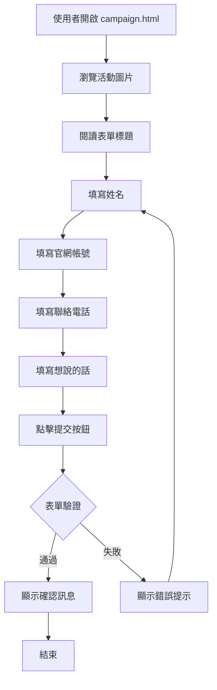

# 使用案例 01：活動報名

## 📋 基本資訊

**使用案例名稱**：活動報名
**使用案例 ID**：UC-01
**頁面**：`campaign.html`
**優先級**：中
**狀態**：已實作

## 🎯 概述

使用者透過網頁表單註冊參加 Comoor 活動，填寫個人資料後送出表單。

## 👥 參與者

- **主要參與者**：網站訪客
- **次要參與者**：無

## 🎬 前置條件

- 使用者可訪問 campaign.html 頁面
- 瀏覽器已啟用 JavaScript

## ✅ 後置條件

### 成功情境
- 使用者成功填寫所有必填欄位
- 瀏覽器顯示確認訊息（alert）

### 失敗情境
- 顯示欄位驗證錯誤提示

## 📝 主要流程

### 詳細步驟

1. **使用者開啟頁面**
   - 訪問 campaign.html
   - 頁面載入活動主視覺圖片與表單

2. **瀏覽活動資訊**
   - 使用者查看活動主視覺
   - 閱讀表單標題「加入我們的活動」

3. **填寫表單欄位**
   - **姓名** (必填)：輸入真實姓名
   - **官網帳號** (必填)：輸入 Comoor 官網帳號
   - **聯絡電話** (必填)：輸入可聯繫的電話號碼
   - **想跟 Comoor 說的話** (必填)：輸入留言或建議

4. **提交表單**
   - 點擊「提交」按鈕
   - 系統執行客戶端驗證

5. **顯示結果**
   - **成功**：彈出 alert 顯示所有填寫內容
   - **失敗**：彈出 alert 提示「請填寫所有必填欄位」

## 🔀 替代流程

### 3a. 使用者跳過必填欄位
**條件**：使用者未填寫某些必填欄位直接點擊提交

**流程**：
1. 瀏覽器內建驗證機制阻止表單送出
2. 顯示瀏覽器預設的必填提示
3. 使用者返回填寫遺漏欄位
4. 繼續主要流程步驟 4

### 4a. JavaScript 驗證失敗
**條件**：所有欄位有填寫但某些欄位為空白

**流程**：
1. JavaScript 檢測到空值
2. 顯示 alert：「請填寫所有必填欄位。」
3. 使用者返回檢查表單
4. 繼續主要流程步驟 3

## 🎨 介面說明

### 頁面元素

#### 活動主視覺
- SVG 漸層圖片（紅→青→藍）
- 文字：CAMPAIGN 2024
- 裝飾圓圈元素
- 響應式設計（最大寬度 600px）

#### 表單區塊
- 標題：「加入我們的活動」
- 四個輸入欄位（文字輸入框）
- 提交按鈕（藍色，hover 效果）

### 響應式設計

| 螢幕寬度 | 調整項目 |
|---------|---------|
| > 1024px | 預設樣式 |
| ≤ 1024px (平板) | 增大字體、增加間距 |
| ≤ 768px (手機) | 調整容器寬度、優化觸控 |
| ≤ 480px (小手機) | 進一步縮小間距 |

## 💾 資料處理

### 目前實作
- **儲存方式**：無後端儲存
- **處理方式**：僅在瀏覽器顯示 alert 確認
- **資料流向**：使用者輸入 → JavaScript 驗證 → Alert 顯示

### 收集欄位

| 欄位名稱 | 類型 | 必填 | 驗證規則 |
|---------|------|------|---------|
| name | 文字 | ✅ | 非空 |
| account | 文字 | ✅ | 非空 |
| phone | 文字 | ✅ | 非空 |
| message | 文字 | ✅ | 非空 |

### 未來擴充建議
如需實際儲存資料，可考慮：
1. Google Apps Script Web App（與 card.html 相同技術）
2. Google Forms 嵌入
3. 第三方表單服務（Typeform、JotForm）
4. 自建後端 API

## 🔒 安全性考量

- ✅ 無敏感資料傳輸（目前僅 alert）
- ✅ 客戶端驗證防止空值
- ⚠️ 無伺服器端驗證（若未來實作需注意）
- ⚠️ 電話號碼未驗證格式（僅檢查非空）

## 📱 瀏覽器相容性

- ✅ 現代瀏覽器（Chrome, Firefox, Safari, Edge）
- ✅ iOS Safari（字體大小 16px 防止自動縮放）
- ✅ Android Chrome
- ⚠️ IE11 不支援（使用 SVG data URL）

## 🧪 測試案例

### TC-01: 成功提交完整表單
**步驟**：
1. 填寫所有欄位
2. 點擊提交

**預期結果**：顯示包含所有填寫內容的 alert

### TC-02: 提交空白表單
**步驟**：
1. 不填寫任何欄位
2. 點擊提交

**預期結果**：瀏覽器顯示「請填寫此欄位」提示

### TC-03: 部分欄位空白
**步驟**：
1. 僅填寫姓名和帳號
2. 點擊提交

**預期結果**：瀏覽器提示未填寫的欄位

### TC-04: 響應式設計測試
**步驟**：
1. 在不同螢幕尺寸開啟頁面
2. 檢查排版與觸控

**預期結果**：所有裝置皆正常顯示且可操作

## 🔗 相關文件

- [主要文檔](../README.md)
- [部署指南](../deployment-guide.md)

## 📊 使用統計建議

若需追蹤使用情況，建議加入：
- Google Analytics 事件追蹤
- 表單開啟次數
- 提交成功/失敗次數
- 各欄位填寫時間

---

**最後更新**：2025-10-05
