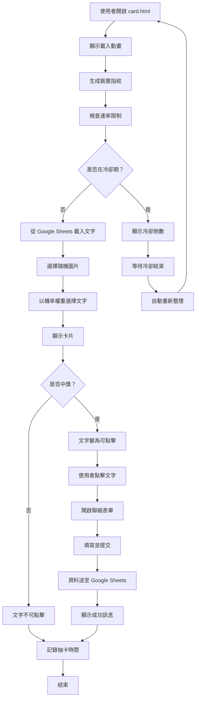

# 使用案例 02：抽卡系統（含中獎機制）

## 📋 基本資訊

**使用案例名稱**：抽卡系統（含中獎機制）
**使用案例 ID**：UC-02
**頁面**：`card.html`
**優先級**：高
**狀態**：已實作

## 🎯 概述

使用者訪問頁面抽取隨機卡片，系統顯示隨機圖片與機率權重的文字。若抽中中獎卡片，文字變為可點擊連結，點擊後開啟聯絡表單收集得獎者資訊。系統具備裝置指紋辨識與速率限制，每台裝置每小時僅可抽卡一次。

## 👥 參與者

- **主要參與者**：想要抽卡的使用者
- **次要參與者**：系統管理員（管理 Google 試算表內容）

## 🎬 前置條件

- 使用者可訪問 card.html
- Google 試算表可正常存取（或使用降級模式）
- 瀏覽器支援 LocalStorage、Canvas、WebGL 等 API

## ✅ 後置條件

### 成功情境
- 使用者看到隨機卡片與文字
- 速率限制記錄已更新
- 若中獎，使用者成功提交聯絡資訊至 Google 試算表

### 失敗情境
- 使用者被速率限制阻擋，看到冷卻倒數計時
- 中獎表單提交失敗，顯示錯誤訊息

## 📝 主要流程



### 詳細步驟

#### 階段一：初始化與速率檢查（3 秒）

1. **頁面載入**
   - 顯示全螢幕載入動畫
   - 文字：「卡片準備中～」、「看看你今天的運勢如何？」

2. **裝置指紋生成**
   - 收集螢幕特徵（解析度、色深、像素比）
   - 收集時區與語言偏好
   - 收集平台資訊（作業系統、核心數、觸控點）
   - 收集瀏覽器特徵（User Agent、插件）
   - 生成 Canvas 指紋
   - 生成 WebGL 指紋
   - 生成音訊指紋
   - 將所有元件組合後進行 SHA-256 雜湊

3. **速率限制檢查**
   - 從 LocalStorage、SessionStorage、IndexedDB 讀取上次抽卡記錄
   - 驗證裝置指紋是否匹配
   - 計算距離上次抽卡的時間
   - 判斷是否超過冷卻時間（1 小時）

4. **載入文字資料**
   - 檢查快取（10 分鐘有效期）
   - 若快取過期，從 Google Sheets 取得 CSV
   - 解析 CSV：文字、機率、中獎標記
   - 驗證資料格式
   - 若失敗，使用預設降級文字

#### 階段二：卡片顯示

5. **選擇卡片元素**
   - **圖片**：從 5 張圖片中等機率隨機選擇
   - **文字**：根據機率權重隨機選擇

6. **顯示卡片**
   - 隱藏載入動畫
   - 顯示選中的圖片
   - 在圖片上疊加顯示選中的文字

7. **判斷中獎狀態**
   - 檢查選中文字的 `won` 欄位
   - 若 `won === 1`：
     - 文字變為藍色可點擊連結
     - 滑鼠游標變為 pointer
     - 文字加上底線
   - 若 `won === 0`：
     - 文字保持黑色
     - 無點擊效果

8. **記錄抽卡時間**
   - 儲存當前時間戳記至 LocalStorage
   - 儲存裝置指紋
   - 備份至 SessionStorage 與 IndexedDB

#### 階段三：中獎處理（僅中獎時）

9. **使用者點擊文字**
   - 阻止預設連結行為
   - 觸發聯絡表單顯示

10. **填寫聯絡表單**
    - 模態視窗覆蓋整個畫面
    - 標題：「🎉 恭喜中獎！」
    - 欄位：
      - 官網帳號 *
      - 連絡電話 *
      - 收件姓名 *
      - 收件地址 *
      - 想對 Comoor 說的話 *

11. **表單驗證與提交**
    - 客戶端驗證所有欄位
    - 送出至 Google Apps Script Web App
    - 資料寫入指定的 Google 試算表

12. **顯示結果**
    - 成功：「✅ 資料已成功送出！我們會盡快與您聯繫，謝謝！」
    - 失敗：「❌ 送出失敗，請稍後再試或檢查網路連線」
    - 3 秒後自動關閉表單

## 🔀 替代流程

### 3a. 使用者在冷卻期內訪問

**條件**：距離上次抽卡未滿 1 小時

**流程**：
1. 載入動畫結束後，顯示模糊的佔位卡片
2. 覆蓋冷卻提示視窗：
   - 圖示：⏰
   - 標題：「抽卡冷卻中」
   - 訊息：「您今天已經抽過卡片了！請稍後再來，每人每小時只能抽取一次。」
   - 倒數計時顯示（HH:MM 格式）
3. 每秒更新倒數計時
4. 冷卻結束時自動重新整理頁面

### 4a. Google Sheets 載入失敗

**條件**：網路錯誤、CORS 失敗、試算表權限問題

**流程**：
1. 控制台記錄錯誤訊息
2. 使用預設降級文字（5 組等機率文字）
3. 繼續正常抽卡流程

### 10a. 使用者取消表單

**條件**：點擊「取消」按鈕或背景遮罩

**流程**：
1. 關閉表單視窗
2. 清除已填寫內容
3. 返回卡片顯示

### 11a. 表單驗證失敗

**條件**：欄位為空、格式錯誤

**流程**：
1. 顯示欄位特定錯誤訊息
2. 欄位邊框變紅
3. 使用者修正後重新提交

### 11b. 表單提交失敗

**條件**：網路錯誤、Apps Script 錯誤

**流程**：
1. 顯示紅色錯誤訊息
2. 表單保持開啟
3. 使用者可重新嘗試提交

## 🎨 介面元素

### 卡片顯示
- **圖片**：最大寬度 540px，圓角 12px，陰影效果
- **文字疊加**：位於圖片中央略上方，20px 字體，黑色加粗
- **中獎文字**：藍色（#0066cc），底線，可點擊

### 載入動畫
- 全螢幕白色背景
- 藍色旋轉圓圈
- 標題與副標題

### 冷卻提示
- 半透明白色遮罩
- 圓角視窗
- 脈衝動畫圖示
- 倒數計時大字體顯示

### 聯絡表單
- 模態視窗（最大寬度 480px）
- 白色背景、圓角、陰影
- 5 個表單欄位
- 兩個按鈕：取消（灰色）、送出（藍色）
- 載入狀態顯示

## 💾 資料結構

### Google 試算表格式

**試算表 ID**：`1ecyT2EcO6shL61eaANXyIS4izuQPlL4eWwJt07GwHPE`
**工作表**：gid=0（金句）

| 欄位 A | 欄位 B | 欄位 C |
|--------|--------|--------|
| 今天很開心 | 0.3 | 0 |
| 昨天很美好 | 0.2 | 0 |
| 抽中大獎！ | 0.05 | 1 |
| 很期待明天 | 0.25 | 0 |
| 會是一個好年的！ | 0.2 | 0 |

- **欄位 A（text）**：顯示的文字內容
- **欄位 B（probability）**：數值，權重（加總不必為 1）
- **欄位 C（won）**：0 或 1，是否為中獎卡片

### 中獎表單資料

送至 Google Apps Script 的 JSON：
```json
{
  "account": "user123",
  "phone": "0912345678",
  "recipientName": "王小明",
  "address": "台北市信義區信義路五段7號",
  "message": "很開心抽中獎品！",
  "timestamp": "2025-10-05T12:34:56.789Z",
  "userAgent": "Mozilla/5.0 ..."
}
```

### LocalStorage 資料

**速率限制**：
```json
{
  "timestamp": 1696502400000,
  "fingerprint": "a3f5e8...",
  "version": 2,
  "created": 1696502400000
}
```

**文字快取**：
```json
[
  {"text": "今天很開心", "probability": 0.3, "won": 0},
  {"text": "昨天很美好", "probability": 0.2, "won": 0}
]
```

## 🔒 安全性與防作弊

### 裝置指紋技術
- **多因子收集**：10+ 個不同特徵
- **模糊比對**：允許 60% 相似度匹配
- **SHA-256 雜湊**：保護隱私，無法反推原始資料

### 三層儲存備份
1. **LocalStorage**（主要）
2. **SessionStorage**（備份）
3. **IndexedDB**（持久化備份）

### 繞過偵測
- 清除單一儲存無效（會從其他儲存復原）
- 更換瀏覽器會被視為不同裝置（允許）
- 隱私模式視為新裝置（允許，但離開後資料消失）

### 已知限制
- ⚠️ 虛擬機器/模擬器可能繞過
- ⚠️ 專業作弊工具可能繞過
- ✅ 對一般使用者足夠有效

## 🧪 測試案例

### TC-01: 首次訪問成功抽卡
1. 清除所有 LocalStorage
2. 訪問 card.html
3. 等待 3 秒載入
4. **預期**：顯示隨機卡片與文字

### TC-02: 一小時內重複訪問
1. 完成 TC-01
2. 立即重新整理頁面
3. **預期**：顯示冷卻提示與倒數計時

### TC-03: 抽中中獎卡片
1. 修改試算表，設定某文字 `won=1`
2. 清除快取，訪問頁面
3. 多次嘗試直到抽中
4. **預期**：文字為藍色可點擊

### TC-04: 提交中獎表單
1. 完成 TC-03
2. 點擊中獎文字
3. 填寫所有表單欄位
4. 點擊送出
5. **預期**：顯示成功訊息，資料寫入試算表

### TC-05: Dev 模式測試
1. 訪問 `card.html?dev=true`
2. 抽卡後等待 10 秒
3. 重新整理頁面
4. **預期**：可再次抽卡

### TC-06: Google Sheets 故障降級
1. 修改程式碼，使用無效的試算表 ID
2. 訪問頁面
3. **預期**：使用降級文字，正常顯示卡片

## 📊 機率計算範例

假設試算表設定：
- 文字 A：probability = 0.5
- 文字 B：probability = 0.3
- 文字 C：probability = 0.2

**總權重** = 0.5 + 0.3 + 0.2 = 1.0

**實際機率**：
- 文字 A：50%
- 文字 B：30%
- 文字 C：20%

**演算法**：
1. 產生 0~1 的隨機數（如 0.65）
2. 從文字 A 開始扣除權重：0.65 - 0.5 = 0.15
3. 從文字 B 扣除權重：0.15 - 0.3 = -0.15（< 0）
4. **選中文字 B**

## 🔗 相關文件

- [防刷機制 (UC-04)](04-rate-limiting.md)
- [Google 試算表管理 (UC-05)](05-google-sheets-management.md)
- [中獎者資料收集 (UC-06)](06-winner-contact-collection.md)
- [簡易抽卡系統 (UC-03)](03-card-drawing-simple.md) - 無中獎版本
- [技術架構](../technical-architecture.md)
- [管理員手冊](../admin-guide.md)

---

**最後更新**：2025-10-05
