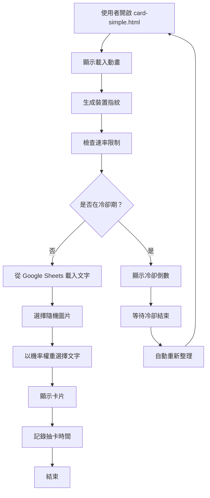

# 使用案例 03：簡易抽卡系統（純展示）

## 📋 基本資訊

**使用案例名稱**：簡易抽卡系統（純展示）
**使用案例 ID**：UC-03
**頁面**：`card-simple.html`
**優先級**：中
**狀態**：已實作

## 🎯 概述

使用者訪問頁面抽取隨機卡片，系統顯示隨機圖片與文字。與 UC-02 不同的是，本版本**無中獎機制**、**無聯絡表單**，文字**不可點擊**，純粹用於展示隨機內容。適合用於「每日一句」、「心靈雞湯」等不需獎品發放的場景。

## 👥 參與者

- **主要參與者**：想要抽取隨機文字的使用者
- **次要參與者**：系統管理員（管理 Google 試算表內容）

## 🎬 前置條件

- 使用者可訪問 card-simple.html
- Google 試算表可正常存取（或使用降級模式）
- 瀏覽器支援 LocalStorage、Canvas、WebGL 等 API

## ✅ 後置條件

### 成功情境
- 使用者看到隨機卡片與文字
- 速率限制記錄已更新

### 失敗情境
- 使用者被速率限制阻擋，看到冷卻倒數計時

## 📝 主要流程



### 詳細步驟

#### 與 UC-02 相同的部分

1. **頁面載入**（同 UC-02）
2. **裝置指紋生成**（同 UC-02）
3. **速率限制檢查**（同 UC-02）
4. **載入文字資料**（同 UC-02，但**忽略 won 欄位**）
5. **選擇卡片元素**（同 UC-02）
6. **顯示卡片**（同 UC-02）
7. **記錄抽卡時間**（同 UC-02）

#### 簡化的部分

**省略的步驟**：
- ❌ 判斷中獎狀態
- ❌ 文字變為可點擊
- ❌ 開啟聯絡表單
- ❌ 收集使用者資料

**簡化處理**：
- 文字始終為黑色
- 文字使用 `<div>` 而非 `<a>` 標籤
- 無任何點擊互動
- cursor 保持預設（default）

## 🔀 替代流程

### 3a. 使用者在冷卻期內訪問
（同 UC-02）

### 4a. Google Sheets 載入失敗
（同 UC-02）

## 🆚 與 UC-02 的差異對照

| 項目 | UC-02 (card.html) | UC-03 (card-simple.html) |
|------|-------------------|--------------------------|
| **功能目的** | 抽獎活動 | 純展示內容 |
| **中獎機制** | ✅ 有 | ❌ 無 |
| **聯絡表單** | ✅ 有 | ❌ 無 |
| **文字點擊** | ✅ 中獎時可點擊 | ❌ 永不可點擊 |
| **試算表欄位** | text, probability, won | text, probability（忽略 won） |
| **HTML 元素** | `<a id="textOverlay">` | `<div id="textOverlay">` |
| **CSS 檔案** | card.css | card-simple.css |
| **JS 檔案** | card.js (1824 行) | card-simple.js (1147 行) |
| **ContactFormManager** | ✅ 有 | ❌ 移除 |
| **防刷系統** | ✅ 有 | ✅ 有（相同） |
| **機率權重** | ✅ 有 | ✅ 有（相同） |
| **載入動畫** | ✅ 有 | ✅ 有（相同） |
| **冷卻時間** | 1 小時 | 1 小時（相同） |
| **Dev 模式** | ✅ 支援 | ✅ 支援（相同） |

## 🎨 介面元素

### 與 UC-02 相同
- 卡片顯示樣式
- 載入動畫
- 冷卻提示視窗

### 移除的元素
- ❌ 聯絡表單模態視窗
- ❌ 表單欄位與驗證
- ❌ 送出按鈕與載入狀態
- ❌ 成功/失敗訊息

### 簡化的元素
- 文字疊加：
  - 無 `winner-link` class
  - 無 hover 效果
  - 無底線
  - cursor: default

## 💾 資料結構

### Google 試算表格式（簡化）

**試算表 ID**：`1ecyT2EcO6shL61eaANXyIS4izuQPlL4eWwJt07GwHPE`
**工作表**：gid=0（金句）

| 欄位 A | 欄位 B | 欄位 C（忽略） |
|--------|--------|---------------|
| 今天很開心 | 0.3 | 任意值 |
| 昨天很美好 | 0.2 | 任意值 |
| 很期待明天 | 0.25 | 任意值 |
| 會是一個好年的！ | 0.25 | 任意值 |

- **僅使用欄位 A 與 B**
- **欄位 C 完全忽略**，即使設為 1 也不會有中獎效果

### JavaScript 資料結構

**降級文字**（無 won 欄位）：
```javascript
const fallbackTexts = [
    { text: "今天很開心", probability: 0.2 },
    { text: "昨天很美好", probability: 0.2 },
    { text: "很期待明天", probability: 0.2 },
    { text: "這兩天都是好天氣", probability: 0.2 },
    { text: "會是一個好年的！", probability: 0.2 }
];
```

### CSV 解析差異

**card.js**（解析 3 欄）：
```javascript
const text = parts[0];
const probability = parseFloat(parts[1]);
const won = parseInt(parts[2]);
textsFromSheet.push({ text, probability, won });
```

**card-simple.js**（僅解析 2 欄）：
```javascript
const text = parts[0];
const probability = parseFloat(parts[1]);
textsFromSheet.push({ text, probability });
// 完全不處理 parts[2]
```

## 🎯 適用場景

### 適合使用 card-simple.html 的情境

✅ **每日一句**
- 展示勵志語錄
- 無需獎品發放
- 單純提供正能量

✅ **心靈雞湯**
- 隨機顯示鼓勵文字
- 增加網站互動性
- 無商業目的

✅ **品牌標語展示**
- 展示品牌理念
- 隨機輪播標語
- 提升品牌形象

✅ **趣味互動**
- 今日運勢
- 隨機建議
- 娛樂性質內容

### 不適合的情境

❌ **需要中獎機制**
→ 請使用 card.html (UC-02)

❌ **需要收集使用者資料**
→ 請使用 card.html (UC-02) 或 campaign.html (UC-01)

❌ **需要點擊連結到其他頁面**
→ 需修改程式碼，加入 URL 欄位

## 🔧 程式碼差異

### 移除的類別
```javascript
// card.js 有，card-simple.js 移除
class ContactFormManager { /* 438 行 */ }
```

### 移除的變數
```javascript
// card.js 有
let contactFormManager = null;

// card-simple.js 移除此變數
```

### 簡化的函式

**card.js 的 initializeCard()**：
```javascript
function initializeCard() {
    // ...選擇圖片與文字...

    // 判斷中獎
    if (randomText.won === 1) {
        textOverlay.href = '#';
        textOverlay.classList.add('winner-link');
        textOverlay.onclick = function(e) {
            e.preventDefault();
            if (contactFormManager) {
                contactFormManager.showForm();
            }
        };
    } else {
        textOverlay.onclick = function(e) { e.preventDefault(); };
    }
}
```

**card-simple.js 的 initializeCard()**：
```javascript
function initializeCard() {
    // ...選擇圖片與文字...

    // 直接顯示，無任何點擊邏輯
    textOverlay.textContent = randomText.text;
}
```

## 🧪 測試案例

### TC-01: 首次訪問成功抽卡
（同 UC-02 TC-01）

### TC-02: 一小時內重複訪問
（同 UC-02 TC-02）

### TC-03: 驗證文字不可點擊
1. 清除 LocalStorage
2. 訪問 card-simple.html
3. 等待卡片顯示
4. 嘗試點擊文字
5. **預期**：無任何反應，cursor 為預設樣式

### TC-04: 驗證忽略 won 欄位
1. 設定試算表某文字 `won=1`
2. 清除快取
3. 訪問 card-simple.html
4. 多次抽卡直到抽中該文字
5. **預期**：文字為黑色，不可點擊

### TC-05: Dev 模式測試
（同 UC-02 TC-05）

### TC-06: Google Sheets 故障降級
（同 UC-02 TC-06）

## 📊 效能比較

| 指標 | card.html | card-simple.html |
|------|-----------|------------------|
| **HTML 大小** | 3,901 bytes | 537 bytes |
| **CSS 大小** | ~18KB | ~10KB |
| **JS 大小** | ~60KB | ~38KB |
| **DOM 元素** | ~50 個 | ~15 個 |
| **初始載入時間** | ~3 秒 | ~3 秒（相同） |
| **記憶體使用** | 較高 | 較低 |

## 🔗 相關文件

- [抽卡系統（含中獎）(UC-02)](02-card-drawing-with-prizes.md) - 完整版本
- [防刷機制 (UC-04)](04-rate-limiting.md)
- [Google 試算表管理 (UC-05)](05-google-sheets-management.md)
- [技術架構](../technical-architecture.md)

## 💡 升級建議

若未來需要從 card-simple.html 升級到 card.html：

1. **複製檔案**
   ```bash
   cp card-simple.html card.html
   cp css/card-simple.css css/card.css
   cp js/card-simple.js js/card.js
   ```

2. **HTML 修改**
   - 將 `<div id="textOverlay">` 改為 `<a id="textOverlay">`
   - 加入聯絡表單 HTML（17-76 行）
   - 更新 CSS/JS 檔案路徑

3. **CSS 修改**
   - 加入 `.winner-link` 樣式
   - 加入 `.contact-form-*` 樣式

4. **JavaScript 修改**
   - 加入 `ContactFormManager` 類別
   - 修改 CSV 解析，處理 won 欄位
   - 修改 `initializeCard()`，加入中獎判斷
   - 初始化 `contactFormManager`

---

**最後更新**：2025-10-05
