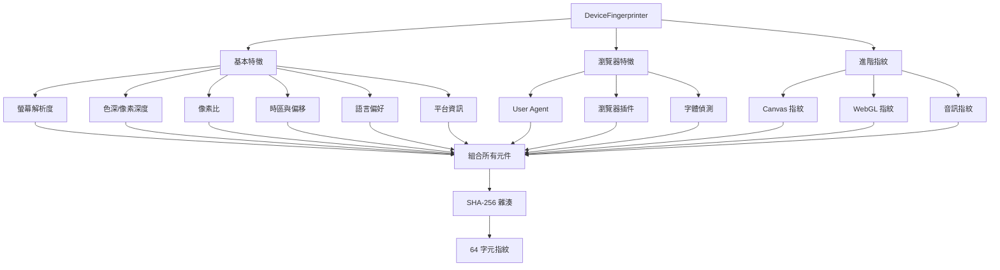
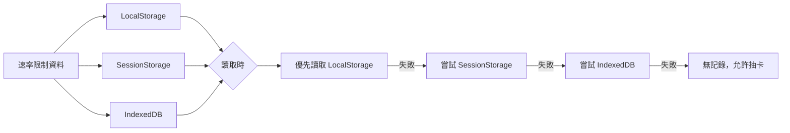
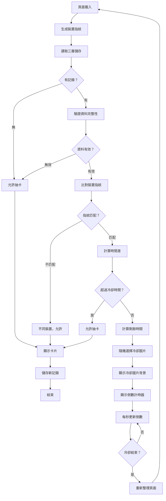

# 使用案例 04：防刷機制

## 📋 基本資訊

**使用案例名稱**：速率限制與防刷系統
**使用案例 ID**：UC-04
**頁面**：`card.html`、`card-simple.html`
**優先級**：高
**狀態**：已實作

## 🎯 概述

系統透過裝置指紋辨識技術，限制每台裝置每小時僅可抽卡一次，防止使用者惡意刷卡或濫用系統。使用多因子裝置特徵收集、SHA-256 雜湊、三層儲存備份，以及模糊比對演算法，確保公平性與防作弊能力。

## 👥 參與者

- **主要參與者**：系統（自動執行）
- **次要參與者**：所有訪問頁面的使用者

## 🎬 前置條件

- 瀏覽器支援 Web Crypto API、Canvas、WebGL、Audio Context
- LocalStorage 可用（未被使用者或擴充功能封鎖）

## ✅ 後置條件

### 成功情境
- 合法使用者通過檢查，可正常抽卡
- 速率限制記錄已儲存至三層儲存

### 失敗情境
- 冷卻期內的使用者被阻擋
- 顯示剩餘冷卻時間

## 📝 技術架構

### 裝置指紋元件



### 裝置指紋詳細說明

#### 1. 螢幕特徵
```javascript
getScreenFingerprint() {
    return `${screen.width}x${screen.height}x${screen.colorDepth}x${screen.pixelDepth}x${window.devicePixelRatio || 1}`;
}
// 範例輸出：「1920x1080x24x24x1」
```

#### 2. 時區資訊
```javascript
getTimezoneFingerprint() {
    const tz = Intl.DateTimeFormat().resolvedOptions().timeZone;
    const offset = new Date().getTimezoneOffset();
    return `${tz}|${offset}`;
}
// 範例輸出：「Asia/Taipei|-480」
```

#### 3. 語言偏好
```javascript
getLanguageFingerprint() {
    const languages = navigator.languages || [navigator.language];
    return languages.join(',') + '|' + navigator.language;
}
// 範例輸出：「zh-TW,en-US|zh-TW」
```

#### 4. 平台資訊
```javascript
getPlatformFingerprint() {
    return `${navigator.platform}|${navigator.hardwareConcurrency || 0}|${navigator.maxTouchPoints || 0}`;
}
// 範例輸出：「MacIntel|8|0」
```

#### 5. Canvas 指紋
```javascript
getCanvasFingerprint() {
    // 繪製特定圖形與文字
    // 不同硬體/驅動程式會產生微小差異
    return canvas.toDataURL().slice(-50);
}
// 範例輸出：「...A3f5e8d2c1b9a8...」（最後 50 字元）
```

#### 6. WebGL 指紋
```javascript
getWebGLFingerprint() {
    const gl = canvas.getContext('webgl');
    const renderer = gl.getParameter(gl.RENDERER);
    const vendor = gl.getParameter(gl.VENDOR);
    return `${vendor}|${renderer}|${version}`.slice(0, 100);
}
// 範例輸出：「Apple|Apple M1|WebGL 1.0」
```

#### 7. 音訊指紋
```javascript
getAudioFingerprint() {
    // 使用 Audio Context 產生音訊波形
    // 不同硬體會有微小差異
    return freqData.slice(0, 10).join('');
}
// 範例輸出：「12345678901234567890」
```

### 三層儲存系統



**儲存資料結構**：
```javascript
{
    timestamp: 1696502400000,      // 上次抽卡時間（毫秒）
    fingerprint: "a3f5e8d2c1...",  // 64字元 SHA-256 雜湊
    version: 2,                     // 資料版本（用於未來升級）
    created: 1696502400000          // 記錄建立時間
}
```

### 速率限制流程



## 🎨 冷卻視窗設計

當使用者處於冷卻期時，系統會顯示特殊的冷卻視窗：

### 視覺設計
- **背景圖片**：隨機選擇以下圖片之一
  - `assets/images/cooldown-yellow.jpg` - 黃色背景的可愛角色
  - `assets/images/cooldown-red.jpg` - 紅色背景的可愛角色
- **倒數計時器**：顯示於圖片中央的白色對話框區域內
  - 顯示「下次可抽卡時間」標籤
  - 顯示剩餘時間（HH:MM 格式）
  - 每秒自動更新

### 技術實作
```javascript
// 隨機選擇冷卻圖片
const cooldownImages = [
    'assets/images/cooldown-yellow.jpg',
    'assets/images/cooldown-red.jpg'
];
const randomCooldownImage = cooldownImages[Math.floor(Math.random() * cooldownImages.length)];

// 設定為背景圖片
overlayElement.style.backgroundImage = `url('${randomCooldownImage}')`;
```

### CSS 樣式
- 背景圖片：`background-size: cover; background-position: center;`
- 倒數容器：絕對定位於中央 (`top: 50%; left: 50%; transform: translate(-50%, -50%)`)
- 文字顏色：深色 (`#333`) 以確保在白色對話框區域清晰可見

## ⚙️ 設定參數

### 冷卻時間設定

**動態配置**：冷卻時間從 Google Sheets 配置表（gid=2058356234）載入

配置表結構：
| 冷卻時間（分） | 獎品名稱 |
|---------------|---------|
| 60            | 精美禮品 |

系統會在頁面載入時自動讀取冷卻時間設定：

```javascript
// 從 Google Sheets 載入配置
const appConfig = {
    cooldownMinutes: 60,     // 預設：60分鐘（從配置表載入）
    prizeTitle: '精美禮品'   // 預設獎品名稱（從配置表載入）
};

// 應用至速率限制配置
const RATE_LIMIT_CONFIG = {
    cooldownHours: isDevMode ? 0.002778 : appConfig.cooldownMinutes / 60,
    cooldownMs: isDevMode ? 10000 : appConfig.cooldownMinutes * 60 * 1000,
    gracePeriodMs: 5 * 60 * 1000,                // 5分鐘寬限期
    debugMode: true                               // 除錯模式
};
```

**配置快取**：
- 配置資料會快取於 LocalStorage 中
- 快取有效期：10 分鐘
- 過期後自動重新載入

**更新冷卻時間**：
1. 編輯 Google Sheets 配置表（gid=2058356234）
2. 修改「冷卻時間（分）」欄位的值
3. 使用者下次載入頁面時自動套用新設定
4. 或等待 10 分鐘快取過期後自動更新

### Dev 模式
在 URL 加上 `?dev=true` 參數：
```
card.html?dev=true
card-simple.html?dev=true
```

**效果**：
- ✅ 冷卻時間從配置值降為 10 秒（覆蓋 Google Sheets 設定）
- ✅ 控制台顯示額外除錯訊息
- ✅ 便於測試速率限制功能

## 🔍 模糊比對演算法

### 為何需要模糊比對？

使用者可能在以下情況下指紋略有變化：
- 調整螢幕解析度
- 更新瀏覽器版本
- 變更系統語言
- 更新顯示卡驅動

### 比對邏輯

```javascript
compareFingerprintsWithFuzzyMatching(stored, current) {
    // 1. 完全匹配
    if (stored === current) return { isMatch: true, confidence: 1.0 };

    // 2. 元件比對
    let matchingComponents = 0;
    let criticalMatches = 0;

    // 關鍵元件（不易變動）
    const criticalKeys = ['screen', 'platform', 'canvas', 'webgl'];

    for (const [key, value] of Object.entries(currentComponents)) {
        if (storedComponents[key] === value) {
            matchingComponents++;
            if (criticalKeys.includes(key)) {
                criticalMatches++;
            }
        }
    }

    // 3. 計算信心分數
    const basicConfidence = matchingComponents / totalComponents;
    const criticalConfidence = criticalMatches / criticalKeys.length;
    const finalConfidence = (basicConfidence * 0.7) + (criticalConfidence * 0.3);

    // 4. 判斷
    const isMatch = finalConfidence >= 0.6;  // 60% 門檻

    return { isMatch, confidence: finalConfidence };
}
```

### 信心分數範例

| 情境 | 基本信心 | 關鍵信心 | 最終信心 | 結果 |
|------|---------|---------|---------|------|
| 完全相同 | 100% | 100% | 100% | ✅ 匹配 |
| 更新瀏覽器 | 80% | 100% | 86% | ✅ 匹配 |
| 調整解析度 | 90% | 75% | 85.5% | ✅ 匹配 |
| 換語言 | 70% | 100% | 79% | ✅ 匹配 |
| 不同裝置 | 20% | 0% | 14% | ❌ 不匹配 |

## 🛡️ 安全性分析

### 防護強度

| 攻擊方式 | 防護效果 | 說明 |
|---------|---------|------|
| 重新整理頁面 | ✅ 完全防護 | 指紋相同，仍在冷卻期 |
| 清除 Cookie | ✅ 完全防護 | 不依賴 Cookie |
| 清除 LocalStorage | ⚠️ 部分防護 | 會從 SessionStorage/IndexedDB 復原 |
| 無痕模式 | ⚠️ 允許通過 | 視為新裝置（合理） |
| 換瀏覽器 | ⚠️ 允許通過 | 不同指紋（合理） |
| 換裝置 | ⚠️ 允許通過 | 不同指紋（預期行為） |
| 虛擬機器 | ❌ 可能繞過 | 專業作弊工具 |
| 指紋偽造工具 | ❌ 可能繞過 | 專業作弊工具 |

### 已知限制

⚠️ **瀏覽器擴充功能**
- 隱私保護擴充可能干擾指紋收集
- 可能導致每次訪問產生不同指紋

⚠️ **企業防火牆/代理**
- 可能影響網路相關的指紋元件
- 通常不影響本地硬體指紋

⚠️ **隱私瀏覽器（如 Tor）**
- 刻意抵抗指紋追蹤
- 會產生隨機化的指紋

⚠️ **專業作弊者**
- 使用虛擬機器 + 指紋偽造工具
- 可能繞過防護（但成本高）

### 對一般使用者的效果

✅ **有效防止**：
- 99% 的一般使用者重複抽卡
- 意外重新整理頁面
- 簡單的作弊嘗試

✅ **平衡設計**：
- 允許合法的多裝置使用
- 允許家人共用電腦
- 允許隱私模式使用

## 🧪 測試指令

### 控制台除錯

```javascript
// 查看當前狀態
window.statusRateLimit()

// 查看指紋元件
window.CardRateLimit.debug.fingerprint()

// 清除所有速率限制
window.clearRateLimit()

// 強制設定冷卻（測試用）
window.CardRateLimit.admin.forceRateLimit(30)  // 30分鐘後可抽

// 調整冷卻時間
window.CardRateLimit.admin.setCooldown(2)  // 改為2小時

// 測試指紋穩定性
window.CardRateLimit.admin.testFingerprint()
```

### 測試案例

**TC-01: 驗證冷卻機制**
```bash
1. 訪問 card.html
2. 抽卡成功
3. 立即重新整理
4. 預期：
   - 顯示隨機冷卻圖片（黃色或紅色背景）
   - 中央白色對話框內顯示倒數計時器
   - 倒數約 59 分鐘
   - 每秒自動更新
```

**TC-02: 驗證 Dev 模式**
```bash
1. 訪問 card.html?dev=true
2. 抽卡成功
3. 等待 10 秒
4. 重新整理
5. 預期：可再次抽卡
```

**TC-03: 驗證三層儲存**
```bash
1. 抽卡後，開啟 DevTools
2. 清除 LocalStorage
3. 重新整理頁面
4. 預期：仍顯示冷卻（從 SessionStorage 復原）
```

**TC-04: 驗證換瀏覽器**
```bash
1. 在 Chrome 抽卡
2. 立即在 Firefox 訪問
3. 預期：可正常抽卡（不同指紋）
```

**TC-05: 驗證指紋穩定性**
```bash
1. 執行 window.CardRateLimit.admin.testFingerprint()
2. 重新整理頁面
3. 再次執行
4. 預期：兩次指紋應完全相同
```

## 📊 效能影響

| 項目 | 耗時 | 說明 |
|------|------|------|
| 指紋生成 | ~200ms | 一次性操作 |
| 儲存讀取 | <10ms | LocalStorage 很快 |
| 模糊比對 | <5ms | 純計算，無 I/O |
| 總延遲 | ~200ms | 對使用者幾乎無感 |

## 🔗 相關文件

- [抽卡系統（含中獎）(UC-02)](02-card-drawing-with-prizes.md)
- [簡易抽卡系統 (UC-03)](03-card-drawing-simple.md)
- [技術架構](../technical-architecture.md)
- [管理員手冊](../admin-guide.md)

---

**最後更新**：2025-10-13
**更新內容**：新增動態冷卻時間配置（從 Google Sheets gid=2058356234 載入）
