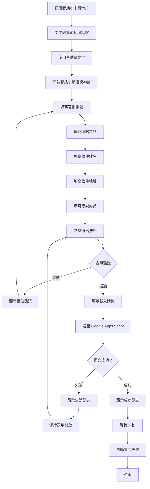

# 使用案例 06：中獎者資料收集

## 📋 基本資訊

**使用案例名稱**：收集中獎者聯絡資訊
**使用案例 ID**：UC-06
**頁面**：`card.html`（僅限）
**優先級**：高
**狀態**：已實作

## 🎯 概述

當使用者抽中中獎卡片（`won=1`）時，點擊文字開啟聯絡表單，填寫收件資訊與留言後送出。資料透過 Google Apps Script Web App 儲存至 Google 試算表，供管理員後續處理獎品寄送。

## 👥 參與者

- **主要參與者**：中獎使用者
- **次要參與者**：管理員（處理中獎者資料）

## 🎬 前置條件

- 使用者抽中 `won=1` 的卡片
- 文字變為藍色可點擊
- Google Apps Script Web App 正常運作

## ✅ 後置條件

### 成功情境
- 中獎者資料成功儲存至 Google 試算表
- 顯示成功訊息
- 3 秒後表單自動關閉

### 失敗情境
- 網路錯誤或 Apps Script 錯誤
- 顯示錯誤訊息
- 表單保持開啟，可重新嘗試

## 📝 主要流程



### 詳細步驟

#### 階段一：開啟表單

1. **使用者抽中中獎卡片**
   - 系統判斷 `randomText.won === 1`
   - 文字變為藍色（#0066cc）
   - 文字加上底線
   - cursor 變為 pointer
   - 控制台記錄：「🏆 Winner detected!」

2. **使用者點擊文字**
   - 觸發 onclick 事件
   - 阻止預設連結行為（`e.preventDefault()`）
   - 呼叫 `contactFormManager.showForm()`

3. **表單顯示**
   - 黑色半透明遮罩覆蓋整個畫面
   - 白色表單視窗從下方滑入（動畫）
   - 標題：「🎉 恭喜中獎！」
   - 副標題：「請填寫聯繫資訊，我們會盡快與您聯繫」
   - 第一個欄位自動聚焦

#### 階段二：填寫表單

4. **查看獎品資訊（唯讀）**
   - **獎品名稱** (prizeTitle) - 自動從配置表載入，唯讀欄位
   - 顯示使用者贏得的獎品名稱（例如：「精美禮品」）
   - 此欄位無法編輯，僅供顯示

5. **填寫必填欄位**
   - **官網帳號** (account)
   - **連絡電話** (phone)
   - **收件姓名** (recipientName)
   - **收件地址** (address)
   - **想對 Comoor 說的話** (message)

6. **即時驗證**
   - 欄位失焦時觸發驗證（optional，目前僅送出時驗證）
   - 錯誤時欄位邊框變紅
   - 顯示欄位特定錯誤訊息

#### 階段三：提交資料

7. **點擊送出按鈕**
   - 觸發 form submit 事件
   - 執行客戶端驗證

8. **驗證規則**
   - **官網帳號**：非空，至少 2 字元
   - **連絡電話**：非空，符合電話格式，至少 8 字元
   - **收件姓名**：非空，至少 2 字元
   - **收件地址**：非空，至少 10 字元
   - **留言**：非空，至少 5 字元
   - **注意**：獎品名稱為唯讀欄位，不需驗證

9. **提交至 Google Apps Script**
   ```javascript
   // 建立 FormData
   const formData = new FormData();
   formData.append('data', JSON.stringify({
       prizeTitle: "精美禮品",
       account: "user123",
       phone: "0912345678",
       recipientName: "王小明",
       address: "台北市信義區信義路五段7號",
       message: "很開心抽中獎品！",
       timestamp: "2025-10-05T12:34:56.789Z",
       userAgent: "Mozilla/5.0 ..."
   }));

   // POST 到 Web App
   const response = await fetch(webAppUrl, {
       method: 'POST',
       body: formData
   });
   ```

10. **顯示結果**
   - **成功**：綠色成功訊息，3 秒後自動關閉
   - **失敗**：紅色錯誤訊息，表單保持開啟

## 🎨 表單介面

### 視覺設計

**模態視窗**：
- 背景遮罩：rgba(0, 0, 0, 0.8)
- 表單視窗：白色，圓角 16px，陰影
- 最大寬度：480px
- 最大高度：90vh（可捲動）

**表單欄位**：
- 邊框：2px solid #e0e0e0
- 聚焦時：邊框變為 #2196F3
- 錯誤時：邊框變為 #f44336

**按鈕**：
- 取消：灰色背景，灰色文字
- 送出：藍色背景，白色文字
- 載入中：顯示旋轉圖示 + 「送出中...」

### 響應式設計

| 螢幕寬度 | 調整 |
|---------|------|
| > 768px | 預設樣式 |
| ≤ 768px | 調整 padding，字體適配觸控 |
| ≤ 480px | 按鈕改為垂直排列 |

### 互動細節

**開啟動畫**：
```css
@keyframes slideUp {
    from {
        opacity: 0;
        transform: translateY(40px);
    }
    to {
        opacity: 1;
        transform: translateY(0);
    }
}
```

**關閉方式**：
1. 點擊「取消」按鈕
2. 點擊背景遮罩
3. 按下 Escape 鍵
4. 成功送出後 3 秒自動關閉

## 💾 資料處理

### Google Apps Script Web App

**Web App URL**：
```
https://script.google.com/macros/s/AKfycbxJ04YQhMx3KzzUAohIOMdcSOd5c1e280FAXLcYSd9J5JzZ-DWDr5_9eBZivRdpFN3xaw/exec
```

### Apps Script 程式碼（參考）

```javascript
function doPost(e) {
  try {
    // 解析資料
    const data = JSON.parse(e.parameter.data);

    // 開啟試算表
    const sheet = SpreadsheetApp.openById('SHEET_ID').getSheetByName('中獎者');

    // 寫入資料（包含獎品名稱）
    sheet.appendRow([
      new Date(),
      data.prizeTitle,
      data.account,
      data.phone,
      data.recipientName,
      data.address,
      data.message,
      data.userAgent
    ]);

    // 回傳成功
    return ContentService.createTextOutput(JSON.stringify({
      success: true,
      message: '資料已儲存'
    })).setMimeType(ContentService.MimeType.JSON);

  } catch (error) {
    return ContentService.createTextOutput(JSON.stringify({
      success: false,
      error: error.toString()
    })).setMimeType(ContentService.MimeType.JSON);
  }
}
```

### 儲存試算表格式

**工作表名稱**：中獎者（或自訂）

| 欄位 | 說明 | 範例 |
|------|------|------|
| 時間戳記 | 自動產生 | 2025-10-13 12:34:56 |
| 獎品名稱 | 從配置表載入 | 精美禮品 |
| 官網帳號 | 使用者輸入 | user123 |
| 連絡電話 | 使用者輸入 | 0912-345-678 |
| 收件姓名 | 使用者輸入 | 王小明 |
| 收件地址 | 使用者輸入 | 台北市信義區... |
| 留言 | 使用者輸入 | 很開心抽中獎品！ |
| User Agent | 自動收集 | Mozilla/5.0 ... |

## 🔒 安全性與驗證

### 客戶端驗證

```javascript
validateForm() {
    let isValid = true;

    // 官網帳號
    const account = document.getElementById('account').value.trim();
    if (!account || account.length < 2) {
        this.showFieldError('account', '官網帳號至少需要2個字');
        isValid = false;
    }

    // 連絡電話
    const phone = document.getElementById('phone').value.trim();
    if (!phone || !/^[\d\-\+\(\)\s]+$/.test(phone) || phone.length < 8) {
        this.showFieldError('phone', '請輸入有效的連絡電話');
        isValid = false;
    }

    // ... 其他欄位驗證
    return isValid;
}
```

### 伺服器端驗證（Apps Script）

建議在 Apps Script 中加入：
- ✅ 資料完整性檢查
- ✅ 長度限制（防止過長資料）
- ✅ 格式驗證（電話、Email 等）
- ✅ 重複提交檢查（同帳號限制）

### 防止濫用

**建議措施**：
1. **同帳號限制**：檢查帳號是否已領獎
2. **IP 限制**：記錄 IP，限制同 IP 提交次數
3. **時間窗口**：限制短時間內多次提交
4. **驗證碼**：加入 reCAPTCHA（optional）

## 🧪 測試案例

### TC-01: 成功提交完整表單

1. 抽中中獎卡片
2. 點擊文字開啟表單
3. 填寫所有欄位
4. 點擊送出
5. **預期**：顯示成功訊息，資料寫入試算表

### TC-02: 空白表單驗證

1. 開啟表單
2. 不填寫任何欄位
3. 點擊送出
4. **預期**：所有欄位顯示紅色錯誤訊息

### TC-03: 部分欄位驗證

1. 填寫官網帳號為「A」（僅 1 字元）
2. 填寫電話為「123」（太短）
3. 其他欄位正常填寫
4. 點擊送出
5. **預期**：官網帳號與電話顯示錯誤

### TC-04: 網路錯誤處理

1. 開啟 DevTools，Network 標籤
2. 設定 Offline 模式
3. 填寫表單並送出
4. **預期**：顯示紅色錯誤訊息，表單不關閉

### TC-05: 取消表單

1. 開啟表單
2. 填寫部分欄位
3. 點擊「取消」按鈕
4. **預期**：表單關閉，資料清空

### TC-06: 鍵盤操作

1. 開啟表單
2. 按下 Escape 鍵
3. **預期**：表單關閉

### TC-07: 背景點擊關閉

1. 開啟表單
2. 點擊黑色背景遮罩
3. **預期**：表單關閉

## 📊 錯誤訊息

### 欄位驗證錯誤

| 欄位 | 錯誤訊息 |
|------|---------|
| 官網帳號（空） | 「請輸入您的官網帳號」 |
| 官網帳號（太短） | 「官網帳號至少需要2個字」 |
| 電話（空） | 「請輸入連絡電話」 |
| 電話（格式錯誤） | 「請輸入有效的連絡電話」 |
| 姓名（空） | 「請輸入收件人姓名」 |
| 姓名（太短） | 「收件人姓名至少需要2個字」 |
| 地址（空） | 「請輸入收件地址」 |
| 地址（太短） | 「請輸入完整的收件地址」 |
| 留言（空） | 「請輸入您想說的話」 |
| 留言（太短） | 「訊息至少需要5個字」 |

### 提交錯誤

| 情況 | 錯誤訊息 |
|------|---------|
| 網路錯誤 | 「❌ 送出失敗，請稍後再試或檢查網路連線」 |
| Apps Script 錯誤 | 「❌ 提交失败: [錯誤詳情]」 |

## 🔗 相關文件

- [抽卡系統（含中獎）(UC-02)](02-card-drawing-with-prizes.md)
- [Google 試算表管理 (UC-05)](05-google-sheets-management.md)
- [管理員手冊](../admin-guide.md)
- [部署指南](../deployment-guide.md)

---

**最後更新**：2025-10-13
**更新內容**：新增獎品名稱唯讀欄位（從配置表 gid=2058356234 載入）
