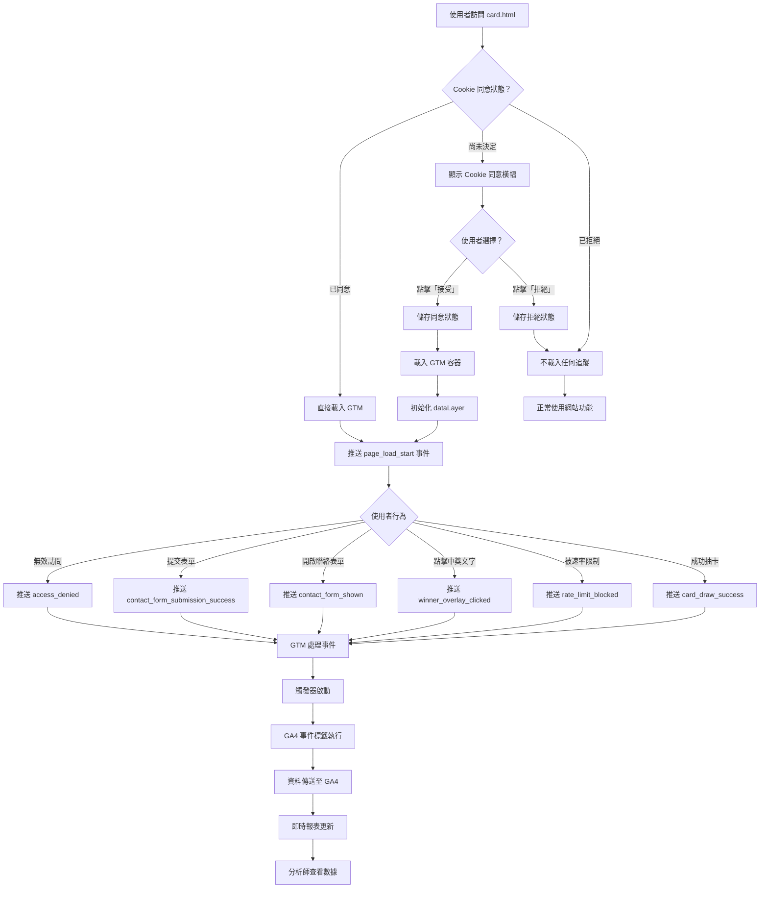

# 使用案例 07：Google Analytics 4 數據追蹤

## 📋 基本資訊

**使用案例名稱**：GA4 + GTM 數據追蹤與分析
**使用案例 ID**：UC-07
**頁面**：`card.html`
**優先級**：高
**狀態**：已實作

## 🎯 概述

透過 Google Tag Manager (GTM) 和 Google Analytics 4 (GA4) 追蹤使用者在抽卡系統中的完整行為，包括頁面載入、卡片抽取、中獎互動、表單提交等關鍵事件。系統採用 Cookie 同意機制，符合 GDPR 隱私法規要求，確保在取得使用者同意後才進行數據追蹤。

## 👥 參與者

- **主要參與者**：使用者（訪問抽卡頁面的使用者）
- **次要參與者**：
  - 行銷團隊（分析數據、優化行銷策略）
  - 產品經理（監控使用者行為、改善產品）
  - 開發團隊（維護追蹤系統、修復問題）

## 🎬 前置條件

- 已設定 Google Tag Manager 容器（GTM-XXXXXXX）
- 已建立 Google Analytics 4 資源（G-XXXXXXXXXX）
- GTM 容器已發布且包含 GA4 設定標籤
- 使用者瀏覽器支援 JavaScript 和 localStorage
- 追蹤系統檔案已正確載入（cookie-consent.js、gtm-datalayer.js）

## ✅ 後置條件

### 成功情境
- 使用者同意 Cookie 使用後，GTM 成功載入
- 所有關鍵事件成功推送至 dataLayer
- 事件資料正確傳送至 GA4
- 數據可在 GA4 報表中查看和分析
- 無個人隱私資訊（PII）外洩

### 失敗情境
- 使用者拒絕 Cookie，無數據追蹤
- GTM 載入失敗，事件進入佇列等待
- 網路錯誤導致事件遺失
- GA4 設定錯誤，事件無法正確歸因

## 📝 主要流程



### 詳細步驟

#### 階段一：Cookie 同意與 GTM 載入

1. **使用者訪問頁面**
   - 載入 `card.html`
   - 初始化 `cookie-consent.js`
   - 檢查 localStorage 中的同意狀態

2. **判斷同意狀態**
   - **若已同意（accepted）**：
     - 直接載入 GTM 容器
     - 初始化 dataLayer
     - 執行所有 onAccept 回調
   - **若已拒絕（declined）**：
     - 不載入任何追蹤
     - 頁面正常運作，無功能限制
   - **若尚未決定（null）**：
     - 顯示 Cookie 同意橫幅於頁面底部
     - 橫幅內容：「我們使用 Cookie 和分析工具來改善您的使用體驗並分析網站流量」
     - 提供「接受」和「拒絕」按鈕

3. **使用者點擊「接受」**
   - 將狀態 `{ status: "accepted", timestamp, version: 1 }` 存入 localStorage
   - 關閉橫幅（淡出動畫）
   - 執行 GTM 載入函式
   - GTM 容器非同步載入
   - 控制台顯示：「✅ GTM loaded: GTM-ABC1234」

4. **使用者點擊「拒絕」**
   - 將狀態 `{ status: "declined", timestamp, version: 1 }` 存入 localStorage
   - 關閉橫幅
   - 不執行任何追蹤相關程式碼
   - 頁面繼續正常運作

#### 階段二：事件追蹤（已同意的情況）

5. **頁面載入事件**
   - 觸發時機：`initializeApp()` 函式開始執行
   - 事件名稱：`page_load_start`
   - 包含資料：
     - dev_mode：是否為開發模式
     - sheet_id：Google Sheets ID
     - timestamp：頁面載入時間戳記

6. **卡片抽取成功**
   - 觸發時機：卡片成功顯示於頁面
   - 事件名稱：`card_draw_success`
   - 包含資料：
     - selected_image：選中的圖片檔名
     - selected_text_title：選中的文字標題
     - text_probability：該文字的機率權重
     - is_winner：是否為中獎卡片
     - text_description_length：描述文字長度
     - total_available_texts：可用文字總數
     - total_available_images：可用圖片總數

7. **中獎者點擊文字**
   - 觸發時機：使用者點擊中獎卡片的文字疊加層
   - 事件名稱：`winner_overlay_clicked`
   - 包含資料：
     - prize_title：獎品名稱（從配置表載入）
     - card_title：中獎卡片標題
     - time_on_page_ms：從頁面載入到點擊的時間

8. **速率限制阻擋**
   - 觸發時機：使用者因冷卻時間未到而被阻擋
   - 事件名稱：`rate_limit_blocked`
   - 包含資料：
     - reason：阻擋原因（"rate_limited"）
     - remaining_time_ms：剩餘冷卻時間（毫秒）
     - cooldown_end_time：冷卻結束時間戳記

9. **聯絡表單提交成功**
   - 觸發時機：中獎者成功提交聯絡資訊
   - 事件名稱：`contact_form_submission_success`
   - 包含資料：
     - prize_title：獎品名稱
     - submission_method：提交方式（"web_app"）
     - time_to_submit_ms：從開始填寫到提交成功的時間
   - **注意**：不包含任何個人資料（電話、地址、姓名等）

10. **訪問控制拒絕**
    - 觸發時機：使用者未透過正確的 URL 訪問頁面
    - 事件名稱：`access_denied`
    - 包含資料：
      - error_message_title：錯誤訊息標題
      - url：嘗試訪問的完整 URL
      - referrer：來源網址或 "direct"
      - found_param：找到的查詢參數（若有）

#### 階段三：GTM 處理與 GA4 傳送

11. **dataLayer 事件推送**
    - 使用 `window.pushToDataLayer(eventName, eventData)` 函式
    - 自動檢查 Cookie 同意狀態
    - 自動過濾個人隱私資訊（PII）
    - 加上時間戳記和同意狀態

12. **GTM 觸發器啟動**
    - 自訂事件觸發器監聽 dataLayer
    - 事件名稱完全符合時觸發
    - 例如：「CE - Card Draw Success」監聽 `card_draw_success` 事件

13. **GA4 事件標籤執行**
    - 觸發器啟動後執行對應的 GA4 事件標籤
    - 從 dataLayer 變數中提取事件參數
    - 使用 GA4 設定標籤的 Measurement ID
    - 組成完整的 GA4 事件並傳送

14. **GA4 接收與處理**
    - 事件傳送至 Google Analytics 4 伺服器
    - 5-10 秒後出現在 DebugView（開發模式）
    - 數分鐘後出現在即時報表
    - 24-48 小時後完整處理並歸入標準報表

## 🔀 替代流程

### 3a. 使用者已在之前訪問時拒絕 Cookie

**條件**：localStorage 中存在 `status: "declined"` 的同意記錄

**流程**：
1. Cookie 同意管理器初始化
2. 讀取到拒絕狀態
3. 不顯示橫幅
4. 不載入 GTM
5. 頁面正常運作
6. **無任何數據追蹤**

### 6a. 使用者在同意前觸發了事件

**條件**：頁面載入時尚未同意，但 JavaScript 已嘗試推送事件

**流程**：
1. `pushToDataLayer()` 被呼叫
2. 檢測到無同意狀態
3. 事件被加入暫存佇列（`eventQueue`）
4. 控制台顯示：「Event "xxx" queued (no consent yet)」
5. 使用者稍後點擊「接受」
6. GTM 載入完成
7. 自動清空佇列，依序推送所有事件

### 9a. 表單提交失敗

**條件**：網路錯誤或 Google Apps Script 錯誤

**流程**：
1. 使用者填寫並提交中獎表單
2. `contact_form_submission_start` 事件推送
3. 提交至 Google Sheets 失敗
4. `contact_form_submission_error` 事件推送
5. 包含資料：
   - error_message：錯誤訊息
   - error_type：錯誤類型
   - retry_available：true（可重試）
6. 表單保持開啟，使用者可重新嘗試

### 13a. GTM 標籤執行失敗

**條件**：GA4 設定標籤配置錯誤或 Measurement ID 無效

**流程**：
1. GTM 觸發器正常啟動
2. GA4 事件標籤嘗試執行
3. 因設定錯誤而失敗
4. GTM Preview Mode 顯示標籤狀態為「Failed」
5. GA4 不會收到事件
6. 需要檢查 GTM 設定並修正

## 🎨 介面元素

### Cookie 同意橫幅

**位置**：頁面底部固定
**樣式**：
- 背景：紫色漸層（#667eea → #764ba2）
- 陰影：0 -4px 20px rgba(0, 0, 0, 0.2)
- 動畫：從底部滑入（transform: translateY(100%) → 0）

**內容**：
```
🍪 Cookie 使用聲明

我們使用 Cookie 和分析工具來改善您的使用體驗並分析網站流量。
點擊「接受」即表示您同意我們使用 Cookie 和 Google Analytics 追蹤。

[拒絕]  [接受]
```

**響應式設計**：
- 桌面版（> 768px）：橫向排列，內容與按鈕並排
- 平板版（≤ 768px）：垂直排列，按鈕水平並排
- 手機版（≤ 480px）：完全垂直，按鈕堆疊排列

### GA4 事件（使用者不可見）

追蹤系統在背景執行，使用者無法直接看到或感知到數據追蹤過程。唯一可見的元素是 Cookie 同意橫幅。

## 💾 資料結構

### Cookie 同意狀態

**儲存位置**：localStorage
**鍵名**：`cookie_consent_status`

```json
{
  "status": "accepted",
  "timestamp": "2025-11-08T12:34:56.789Z",
  "version": 1
}
```

### dataLayer 事件範例

#### 卡片抽取成功事件

```javascript
{
  "event": "card_draw_success",
  "selected_image": "images/backgrounds/gradient-1.svg",
  "selected_text_title": "今天很開心",
  "text_probability": 0.3,
  "is_winner": false,
  "text_description_length": 45,
  "total_available_texts": 8,
  "total_available_images": 5,
  "_timestamp": 1730000000000,
  "_consent_status": "accepted"
}
```

#### 中獎者點擊事件

```javascript
{
  "event": "winner_overlay_clicked",
  "prize_title": "精美禮品",
  "card_title": "抽中大獎！",
  "time_on_page_ms": 2500,
  "_timestamp": 1730000002500,
  "_consent_status": "accepted"
}
```

#### 表單提交成功事件

```javascript
{
  "event": "contact_form_submission_success",
  "prize_title": "精美禮品",
  "submission_method": "web_app",
  "time_to_submit_ms": 1250,
  "_timestamp": 1730000005000,
  "_consent_status": "accepted"
}
```

**注意**：所有事件自動包含：
- `_timestamp`：推送時間（Unix 毫秒）
- `_consent_status`：同意狀態（"accepted" | "declined" | "pending"）

## 📊 追蹤事件總覽

### 高優先級事件（核心業務指標）

| 事件名稱 | 觸發時機 | 業務價值 |
|---------|---------|---------|
| `card_draw_success` | 成功抽卡 | 衡量使用者參與度、分析熱門卡片 |
| `contact_form_submission_success` | 中獎表單提交 | 追蹤轉換率、監控中獎者數量 |
| `winner_overlay_clicked` | 中獎者點擊 | 評估中獎者參與意願 |
| `rate_limit_blocked` | 速率限制阻擋 | 分析使用者摩擦點、優化冷卻時間 |
| `access_denied` | 無效訪問 | 監控非法訪問、改善入口點設計 |

### 中優先級事件（使用者體驗與可靠性）

| 事件名稱 | 觸發時機 | 業務價值 |
|---------|---------|---------|
| `contact_form_validation_error` | 表單驗證失敗 | 識別表單問題、改善使用者體驗 |
| `rate_limit_allowed` | 通過速率檢查 | 了解成功訪問率 |
| `config_load_success/error` | 配置載入 | 監控系統健康度 |
| `access_control_validation` | 訪問驗證 | 驗證入口點效果 |

### 低優先級事件（可選分析）

| 事件名稱 | 觸發時機 | 業務價值 |
|---------|---------|---------|
| `page_load_start` | 頁面載入 | 性能監控基準點 |
| `contact_form_shown/hidden` | 表單開關 | 表單互動分析 |
| `initialization_error` | 初始化錯誤 | 技術問題監控 |

## 🔒 隱私與安全

### PII（個人識別資訊）防護

系統自動過濾以下欄位，**絕不追蹤**：
- ❌ 電話號碼（phone）
- ❌ 電子郵件（email）
- ❌ 完整姓名（name, recipientName）
- ❌ 地址（address）
- ❌ 帳號 ID（account）
- ❌ IP 位址
- ❌ 使用者 ID

### 追蹤的隱私安全資料

僅追蹤聚合性、無法識別個人的資料：
- ✅ 欄位長度（不含內容）：`message_length: 45`
- ✅ 布林值標記：`is_winner: true`, `has_phone: true`
- ✅ 截斷的雜湊值：`fingerprint_hash: "a3f5e8d2..."` （僅前 16 字元）
- ✅ 計數統計：`error_count: 2`, `invalid_fields: ["phone", "address"]`
- ✅ 時間戳記：`timestamp: 1730000000`
- ✅ 機率與權重：`text_probability: 0.3`

### GDPR 合規性

- ✅ **明確同意**：使用者必須主動點擊「接受」
- ✅ **可拒絕選項**：提供「拒絕」按鈕且無功能損失
- ✅ **透明說明**：清楚說明 Cookie 用途
- ✅ **選擇持久化**：同意決定儲存於 localStorage
- ✅ **無 PII 外洩**：自動過濾機制防止隱私資料洩漏
- ✅ **可撤回同意**：使用者可清除 localStorage 重新選擇

## 📈 分析應用場景

### 場景一：優化卡片內容

**目標**：了解哪些卡片最受歡迎

**使用事件**：`card_draw_success`

**分析方式**：
1. 在 GA4 中建立自訂報表
2. 維度：`selected_text_title`
3. 指標：事件計數
4. 篩選：`is_winner = false`（排除中獎卡片）
5. 排序：由高到低

**洞察範例**：
- 發現「今天很開心」出現頻率最高（30%）
- 「很期待明天」次之（25%）
- 可調整機率權重以平衡分布

### 場景二：監控轉換漏斗

**目標**：追蹤從中獎到提交的完整流程

**使用事件**：
1. `card_draw_success` (is_winner = true)
2. `winner_overlay_clicked`
3. `contact_form_shown`
4. `contact_form_submission_success`

**分析方式**：
1. 在 GA4 建立漏斗探索
2. 步驟 1：中獎卡片顯示
3. 步驟 2：點擊中獎文字
4. 步驟 3：開啟表單
5. 步驟 4：成功提交

**洞察範例**：
- 100 人抽中獎品
- 85 人點擊文字（85% 點擊率）
- 78 人開啟表單（91.8% 開啟率）
- 65 人成功提交（83.3% 提交率）
- **總轉換率：65%**
- **改善機會**：提升表單提交率（可能的問題：欄位過多、驗證過嚴）

### 場景三：速率限制效果分析

**目標**：評估冷卻時間設定是否合理

**使用事件**：
- `rate_limit_blocked`
- `rate_limit_allowed`

**分析方式**：
1. 計算被阻擋率：blocked / (blocked + allowed)
2. 分析剩餘冷卻時間分布（`remaining_time_ms`）
3. 對比不同冷卻設定的使用者滿意度

**洞察範例**：
- 被阻擋率：35%
- 平均剩餘時間：25 分鐘
- **結論**：35% 的使用者在冷卻期內重訪，顯示高度參與意願
- **建議**：考慮縮短冷卻時間或提供「分享獲得額外抽獎」機制

### 場景四：訪問來源追蹤

**目標**：了解使用者從何而來

**使用事件**：
- `access_denied`（referrer 欄位）
- `access_control_validation`（正常訪問）

**分析方式**：
1. 維度：`referrer`
2. 指標：事件計數
3. 區分有效訪問與無效訪問

**洞察範例**：
- 有效訪問（有 `?from=picsee`）：85%
- 無效訪問來源：
  - 直接輸入網址：8%
  - 社群分享連結（無參數）：5%
  - 搜尋引擎：2%
- **行動**：在社群分享加上正確參數、教育使用者透過 QR Code 訪問

## 🧪 測試案例

### TC-01: Cookie 同意橫幅首次顯示

1. 清除瀏覽器 localStorage
2. 訪問 `card.html?from=picsee`
3. **預期**：Cookie 同意橫幅從底部滑入
4. **預期**：尚未載入 GTM（檢查 Network 標籤）

### TC-02: 接受 Cookie 後 GTM 載入

1. 完成 TC-01
2. 點擊「接受」按鈕
3. **預期**：橫幅淡出並消失
4. **預期**：控制台顯示「✅ GTM loaded: GTM-XXXXXXX」
5. **預期**：Network 標籤顯示 GTM 腳本載入
6. **預期**：`window.google_tag_manager` 存在

### TC-03: 拒絕 Cookie 不追蹤

1. 清除 localStorage
2. 訪問頁面
3. 點擊「拒絕」按鈕
4. **預期**：橫幅消失
5. **預期**：不載入 GTM
6. **預期**：重新整理頁面後橫幅不再出現
7. **預期**：頁面功能正常運作

### TC-04: 卡片抽取事件追蹤

1. 清除 localStorage 並接受 Cookie
2. 等待卡片抽取完成
3. 開啟瀏覽器控制台
4. 執行：`console.table(window.dataLayer)`
5. **預期**：看到 `card_draw_success` 事件
6. **預期**：包含 `selected_text_title`, `is_winner` 等欄位

### TC-05: 中獎流程完整追蹤

1. 修改 Google Sheet 設定某文字 `won=1`
2. 清除快取並接受 Cookie
3. 抽中中獎卡片
4. 點擊中獎文字
5. 填寫並提交表單
6. **預期 dataLayer 包含以下事件（依序）**：
   - `page_load_start`
   - `card_draw_success` (is_winner: true)
   - `winner_overlay_clicked`
   - `contact_form_shown`
   - `contact_form_submission_start`
   - `contact_form_submission_success`

### TC-06: GA4 DebugView 驗證

1. 在 GA4 開啟 DebugView
2. 執行 TC-05
3. **預期**：所有事件在 5-10 秒內出現於 DebugView
4. **預期**：事件參數正確顯示
5. **預期**：無錯誤訊息

### TC-07: GTM Preview Mode 驗證

1. 在 GTM 點擊「Preview」
2. 輸入 `card.html?from=picsee`
3. 接受 Cookie
4. 抽取卡片
5. **預期 Tag Assistant 顯示**：
   - 「GA4 Configuration」標籤已觸發
   - 「GA4 Event - Card Draw Success」標籤已觸發
   - 所有標籤狀態為「Fired Successfully」

### TC-08: PII 防護測試

1. 開啟控制台 debug 模式：`window.dataLayerManager.enableDebug()`
2. 填寫中獎表單（包含電話、地址等）
3. 提交表單
4. 檢查 `contact_form_submission_success` 事件
5. **預期**：不包含 `phone`, `address`, `recipientName` 等 PII 欄位
6. **預期**：僅包含 `prize_title`, `submission_method`, `time_to_submit_ms`

## 📊 建議報表與儀表板

### 儀表板 1：使用者參與概覽

**指標**：
- 總訪問數（`page_load_start` 計數）
- 成功抽卡數（`card_draw_success` 計數）
- 被阻擋數（`rate_limit_blocked` 計數）
- 中獎數（`card_draw_success` where `is_winner = true`）
- 轉換數（`contact_form_submission_success` 計數）

**圖表**：
- 折線圖：每日訪問趨勢
- 圓餅圖：抽卡成功 vs. 被阻擋比例
- 長條圖：熱門卡片排行（依 `selected_text_title`）

### 儀表板 2：轉換漏斗

**步驟**：
1. 中獎卡片抽中
2. 點擊中獎文字
3. 開啟表單
4. 成功提交

**指標**：
- 各步驟轉換率
- 各步驟流失率
- 平均提交時間（`time_to_submit_ms`）

### 儀表板 3：系統健康監控

**指標**：
- 配置載入成功率（`config_load_success` / `config_load_error`）
- 表單提交成功率（`success` / `error`）
- 表單驗證錯誤分布（依 `invalid_fields`）
- 初始化錯誤數（`initialization_error` 計數）

**警報設定**：
- 配置載入失敗率 > 5%
- 表單提交失敗率 > 10%
- 初始化錯誤數 > 10 次/天

### 儀表板 4：訪問控制分析

**指標**：
- 有效訪問數（`access_control_validation` where `access_granted = true`）
- 無效訪問數（`access_denied` 計數）
- 訪問來源分布（依 `referrer`）
- 無效訪問的查詢參數（依 `found_param`）

## 🔗 相關文件

- [技術實作文件（英文）](../ga4-gtm-implementation.md) - 開發者技術指南
- [抽卡系統（含中獎）(UC-02)](02-card-drawing-with-prizes.md) - 主要功能
- [中獎者資料收集 (UC-06)](06-winner-contact-collection.md) - 表單流程
- [防刷機制 (UC-04)](04-rate-limiting.md) - 速率限制
- [專案說明](../../CLAUDE.md) - 整體架構

## 📝 附註

### Cookie 同意橫幅客製化

若需修改橫幅文字或樣式，請編輯：
- **文字內容**：`js/cookie-consent.js` 第 89-103 行
- **樣式**：`css/cookie-consent.css`

### GTM 容器 ID 更新

**位置 1**：`card.html` 第 18 行
```javascript
window.GTM_ID = 'GTM-ABC1234'; // 替換為您的實際 ID
```

**位置 2**：`card.html` 第 52 行
```html
<noscript><iframe src="https://www.googletagmanager.com/ns.html?id=GTM-ABC1234"
```

### Debug 模式啟用

在瀏覽器控制台執行：
```javascript
// 啟用 dataLayer debug 日誌
window.dataLayerManager.enableDebug();

// 查看所有已推送事件
console.table(window.dataLayer);

// 重置 Cookie 同意（測試用）
window.cookieConsent.reset();
location.reload();
```

---

**最後更新**：2025-11-08
**文件版本**：1.0
**實作狀態**：✅ 已完成
